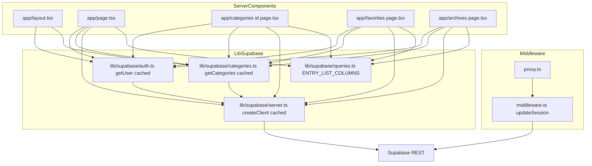
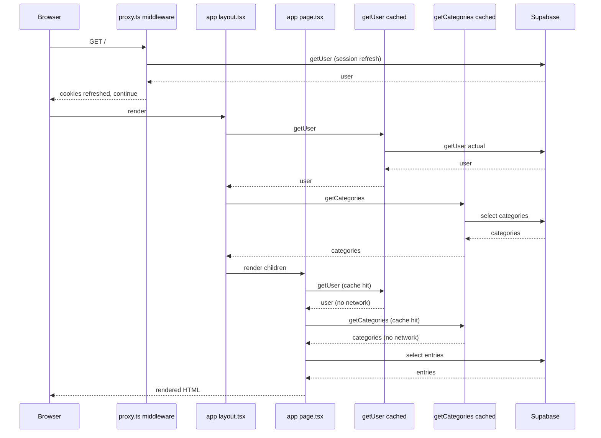
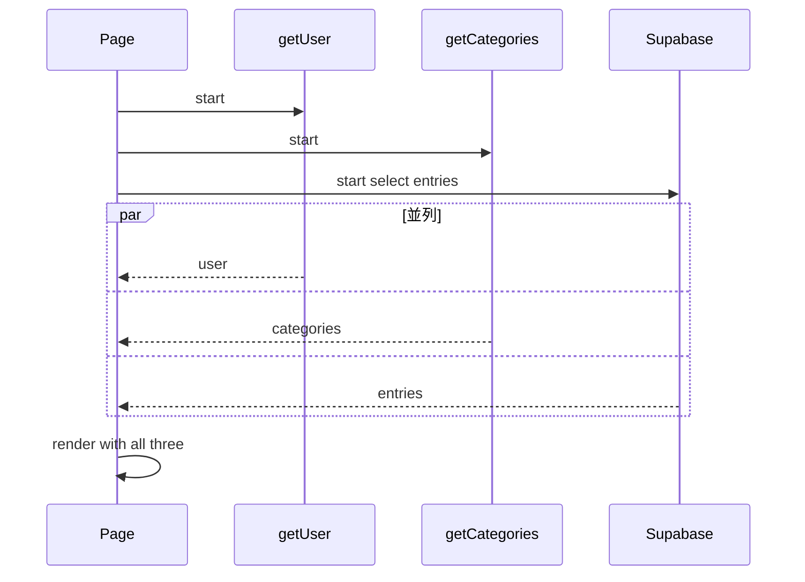

# Design Document — performance-optimization

## Overview

本機能は `jibun database` の Server Component レンダリング時のデータ取得経路を最適化する改善である。

**Purpose**: 1 ページ描画あたりに発生している Supabase への冗長な往復（認証情報・`categories` の重複取得、直列 `await`、過剰カラム転送）を排除し、体感で「速くなった」とわかる描画に改善する。

**Users**: 閲覧ユーザー全員（ログイン状態を問わず）および登録作業をする本人。

**Impact**: 既存の Next.js 16 App Router (Server Component first) アーキテクチャと RLS・認証フローは維持したまま、データ取得層のパターンのみを変更する。UI コンポーネント・ルーティング・カテゴリ定義・認証フローには一切触れない。

### Goals
- 1 リクエストあたり Server Component 側の `getUser()` 呼び出しを最大 1 回に集約する
- 1 リクエストあたり `categories` データ取得を最大 1 回に集約する
- Server Component 内の独立した非同期取得を並列化する
- `entries` 一覧クエリで不要カラム（`description` / `author`）を転送しない
- `is_archived` / `is_favorite` に対する DB インデックスを用意する
- 改善前後で全画面の表示・認証分岐・RLS 挙動が一致する

### Non-Goals
- Client Component の再設計・状態管理の刷新
- Supabase 以外のキャッシュ層の導入（Redis / Vercel KV 等）
- Supabase リージョン変更や別 DB への移行
- 画像配信 / CDN / フロント bundle の最適化
- API Route (`src/app/api/...`) のデータ取得パターンの変更
- 具体的な数値目標（TTFB xx ms 以下等）の達成コミット
- タグ機能（`tags` / `entry_tags`）に関するクエリ最適化

## Boundary Commitments

### This Spec Owns
- Server Component の render path で発生する Supabase クライアント生成・認証取得・`categories` 取得・`entries` 一覧取得のパターン
- `entries` 一覧クエリの SELECT カラム定義（single source of truth）
- `is_archived` / `is_favorite` カラム向けの DB インデックス定義（`docs/schema.sql` への反映 + 人間側の適用手順提示）
- 上記のために新設する `lib/supabase` 配下の helper ファイル
- 既存の Server Component ページ（`layout.tsx`, `page.tsx`, `categories/[id]/page.tsx`, `favorites/page.tsx`, `archives/page.tsx`）での helper 採用

### Out of Boundary
- `src/app/api/**` (API Route) 内のデータ取得パターン（副次的な改善は起きるが意図的な変更対象にしない）
- `src/lib/supabase/middleware.ts` / `proxy.ts`（middleware 側の `getUser()` はセッションリフレッシュ目的なので触らない）
- Client Component（`EntryCard`, `EntryEditModal`, `LoginForm` 等）
- `EntryForm` / `fetch-meta` 系のメタデータ取得ロジック
- UI・スタイリング・カテゴリ定数・型定義の変更
- タグ機能関連のテーブル・クエリ

### Allowed Dependencies
- React 19 の `cache` API（`import { cache } from 'react'`）
- `@supabase/ssr` 0.8（既存依存）の `createServerClient`
- 既存の `src/lib/supabase/server.ts`（今回拡張する）
- 既存の `src/lib/types/*`（Entry / Categories 等を参照する）
- `docs/schema.sql`（インデックス追加のために更新する）

依存制約:
- `lib/` → `components/` は禁止（既存ルール）
- `lib/supabase/server.ts` は Server Component / API Route からのみ呼ぶ（既存ルール維持）
- 新設 helper は `'use client'` を持たず Server Component 専用とする

### Revalidation Triggers
下記の変更が入った場合は、本機能に依存しているページ（`layout.tsx` 含む）を再確認する必要がある:
- `Entry` 型 (`src/lib/types/entry.ts`) にカラムを追加・削除した → `ENTRY_LIST_COLUMNS` の更新が必要
- Supabase `@supabase/ssr` のメジャーバージョンアップ → `cache()` 内部で生成するクライアント挙動の再確認
- `layout.tsx` の children 受け渡し構造を変更した
- 新しい Server Component ページを追加した → 本 helper の採用を検討

## Architecture

### Existing Architecture Analysis

現行の `jibun database` は次の構造でデータ取得を行っている:

- **`proxy.ts` (middleware)**: `updateSession()` で `supabase.auth.getUser()` を呼んでセッションをリフレッシュ。これは別 request context で独立動作
- **`src/lib/supabase/server.ts`**: `createClient()` は呼ばれるたびに新しい `createServerClient` インスタンスを返す。`cache()` ラップ無し
- **`src/app/layout.tsx`**: `createClient()` → `getUser()` → `supabase.from('categories').select('*')` を直列実行し、`categories` を `Sidebar` / `CategoryNav` に渡す
- **各 page (`/`, `/categories/[id]`, `/favorites`, `/archives`)**: 同じく `createClient()` → `getUser()` → `entries` fetch → `categories` fetch を**すべて直列で**実行

既存の dependency direction（`types → supabase → app/components`）は維持する。新設 helper は `src/lib/supabase/` 配下に配置され、この方向に従う。

### Architecture Pattern & Boundary Map



**Architecture Integration**:
- **Selected pattern**: Request-scoped memoization via React `cache()` + parallel data loading via `Promise.all`。新しい抽象レイヤは導入せず、既存の Server Component パターン内で完結
- **Domain / feature boundaries**: helper は `lib/supabase` 配下に閉じる。components / app 側には fetch 実装が漏れない
- **Existing patterns preserved**: `lib/supabase/{server,client,middleware}.ts` の 3 分割構造、`docs/schema.sql` single source of truth、Server Component first、`style={{}}` 禁止等
- **New components rationale**:
  - `lib/supabase/auth.ts`: 認証取得の dedup を確定させる
  - `lib/supabase/categories.ts`: カテゴリ取得の dedup を確定させる
  - `lib/supabase/queries.ts`: SELECT カラムの single source of truth
- **Steering compliance**: `tech.md`（Server Component first / cookie 連携 / RLS 委譲）と `structure.md`（`lib/` layering / `@/` absolute import）に準拠

### Technology Stack

| Layer | Choice / Version | Role in Feature | Notes |
|-------|------------------|-----------------|-------|
| Frontend | Next.js 16.1.6 / React 19.2.3 | Server Component のレンダリング基盤 | `cache` を react から import |
| Backend / Services | `@supabase/ssr` 0.8 | `createServerClient` の cookie 連携 | 既存依存。バージョン変更なし |
| Data / Storage | Supabase (Postgres) | `entries` / `categories` テーブルの SELECT とインデックス定義 | インデックス追加は人間側作業（SQL Editor） |
| Runtime | Node.js (Next.js server) | Server Component の実行環境 | 変更なし |

新規依存は無い。全て既存スタック内で完結する。

## File Structure Plan

### Directory Structure
```
src/
└── lib/
    └── supabase/
        ├── server.ts             # [変更] createClient を cache() でラップ
        ├── auth.ts               # [新規] getUser() を cache() でラップ
        ├── categories.ts         # [新規] getCategories() を cache() でラップ
        ├── queries.ts            # [新規] ENTRY_LIST_COLUMNS 定数
        ├── client.ts             # [変更なし] Client Component 用
        └── middleware.ts         # [変更なし] proxy.ts から呼ばれるセッションリフレッシュ
src/app/
├── layout.tsx                    # [変更] auth/categories helper 経由 + Promise.all
├── page.tsx                      # [変更] helper 経由 + Promise.all + ENTRY_LIST_COLUMNS
├── categories/[id]/page.tsx      # [変更] 同上（+ generateMetadata も helper 経由）
├── favorites/page.tsx            # [変更] 同上
└── archives/page.tsx             # [変更] 同上
docs/
└── schema.sql                    # [変更] is_archived / is_favorite のインデックス定義追加
```

### Modified Files

- `src/lib/supabase/server.ts` — `createClient` の `async` 関数本体を `cache(async () => {...})` でラップする。export signature（`createClient: () => Promise<SupabaseClient>`）は変更しない
- `src/app/layout.tsx` — `createClient` + `getUser` + `categories` fetch の直列実行を `Promise.all([getUser(), getCategories()])` に置換
- `src/app/page.tsx` — 同じく helper 化 + `Promise.all` + `entries` クエリの SELECT を `ENTRY_LIST_COLUMNS` に置換
- `src/app/categories/[id]/page.tsx` — `generateMetadata` 内の `categories` fetch を `getCategories()` に置換。page 本体も同様に helper + `Promise.all` + `ENTRY_LIST_COLUMNS`
- `src/app/favorites/page.tsx` — 同上
- `src/app/archives/page.tsx` — 同上
- `docs/schema.sql` — `CREATE INDEX idx_entries_is_archived ON entries(is_archived);` と `CREATE INDEX idx_entries_is_favorite ON entries(is_favorite);` を追加

### New Files

- `src/lib/supabase/auth.ts` — `getUser()` helper（React `cache()` ラップ）
- `src/lib/supabase/categories.ts` — `getCategories()` helper（React `cache()` ラップ）
- `src/lib/supabase/queries.ts` — `ENTRY_LIST_COLUMNS` 定数

## Requirements Traceability

| Requirement | Summary | Components | Interfaces | Flows |
|-------------|---------|------------|------------|-------|
| 1.1 | Server Component 認証取得を 1 回に集約 | `lib/supabase/auth.ts`, `lib/supabase/server.ts`, 各 page / layout | `getUser(): Promise<User \| null>` (cached) | 下記 Sequence 1 |
| 1.2 | middleware 由来の `getUser` は集約対象外 | `proxy.ts`, `lib/supabase/middleware.ts` | 変更なし（現状維持） | 下記 Sequence 1 |
| 1.3 | 認証集約前後でログイン判定・UI 表示が不変 | 全 Server Component page | `getUser` の戻り値型は `User \| null` で従来と同一 | — |
| 2.1 | `categories` 取得を 1 回に集約 | `lib/supabase/categories.ts`, 各 page / layout | `getCategories(): Promise<Categories>` (cached) | 下記 Sequence 1 |
| 2.2 | `categories` 集約前後で表示・並び・挙動が不変 | `Sidebar`, `CategoryNav`, 各 page | 戻り値は既存 `Categories` 型と同一 | — |
| 3.1 | 独立した取得を並列実行 | 各 Server Component page | `Promise.all([getUser(), getCategories(), entriesFetch])` パターン | 下記 Sequence 2 |
| 3.2 | 依存がある取得は直列実行を許容 | `categories/[id]/page.tsx`（category 存在チェック → entries fetch の順序制約） | — | — |
| 3.3 | 並列化前後で結果集合が不変 | 全 Server Component page | — | — |
| 4.1 | 一覧クエリで SELECT カラムを明示 | `lib/supabase/queries.ts` + 各 page | `ENTRY_LIST_COLUMNS: string` 定数 | — |
| 4.2 | 既存 `EntryCard` 等が必要なデータが欠落しない | 各 page + `EntryCard` | `ENTRY_LIST_COLUMNS` が `Entry` 型と一致 | — |
| 4.3 | 将来の詳細画面で追加カラム取得可 | (将来) 詳細画面 | `ENTRY_LIST_COLUMNS` を base に拡張可能な定数化 | — |
| 5.1 | `is_archived` / `is_favorite` に index | `docs/schema.sql` | `CREATE INDEX` 2 本 | — |
| 5.2 | 追加 index を `docs/schema.sql` に反映 | `docs/schema.sql` | 既存スキーマ定義の末尾に追記 | — |
| 5.3 | 人間側の適用手順を提示 | 本 design.md + tasks.md | 手順は tasks 内に記載 | — |
| 5.4 | index 追加前後でクエリ結果集合が不変 | `entries` クエリ全般 | 既存の WHERE / ORDER は不変 | — |
| 6.1 | 全画面の表示・操作結果が不変 | 全 Server Component page | — | 手動検証 |
| 6.2 | 認証状態 UI 分岐が不変 | `layout.tsx`, `/`, `EntryForm`, `EntryCardMenu` 等 | `isLoggedIn = !!user` のロジック維持 | 手動検証 |
| 6.3 | RLS による書き込み権限挙動が不変 | `api/entries/*` | 変更対象外 | 手動検証 |
| 6.4 | X 即登録・排他制御・OGP 502 等の既存挙動が不変 | `api/entries/*`, `api/fetch-meta`, `EntryForm` | 変更対象外 | 手動検証 |

## System Flows

### Sequence 1: 改善後の 1 ページ描画での認証・カテゴリ取得



**Key Decisions**:
- middleware の `getUser` は意図的に dedup 対象外（別 request context）
- layout と page のどちらが先に helper を呼んでも結果は同じ（`cache()` がどちらの先着も memoize する）
- `Promise.all` で並列化しても内部の `cache()` dedup は機能する（同じ引数の並行呼び出しは単一の pending promise を共有）

### Sequence 2: 並列化パターン（page 内）



**Key Decisions**:
- `getUser` / `getCategories` / `entries` は互いに独立しているので `Promise.all` で同時に走らせる
- `/categories/[id]` のみ、`categories` 取得結果から該当 `category` を抽出してから `entries` を fetch する必要があり、部分的に直列が残る（これは Requirement 3.2 の許容ケース）

## Components and Interfaces

| Component | Domain/Layer | Intent | Req Coverage | Key Dependencies (P0/P1) | Contracts |
|-----------|--------------|--------|--------------|--------------------------|-----------|
| `createClient` (修正) | lib/supabase | Supabase Server Client factory（request-scoped cached） | 1.1, 2.1, 3.1 | `@supabase/ssr` (P0), `next/headers` (P0), `react cache` (P0) | Service |
| `getUser` (新規) | lib/supabase | 認証情報取得の request-scoped cached helper | 1.1, 1.3 | `createClient` (P0), `react cache` (P0) | Service |
| `getCategories` (新規) | lib/supabase | `categories` 取得の request-scoped cached helper | 2.1, 2.2 | `createClient` (P0), `react cache` (P0) | Service |
| `ENTRY_LIST_COLUMNS` (新規) | lib/supabase | `entries` 一覧取得の SELECT カラム定数 | 4.1, 4.2, 4.3 | `Entry` type (P0, 暗黙の契約) | State (定数) |
| `layout.tsx` (修正) | app | レイアウト共通の `user` / `categories` 取得を helper 経由に置換 | 1.1, 2.1, 3.1, 6.1, 6.2 | `getUser` (P0), `getCategories` (P0) | — |
| `/` `page.tsx` (修正) | app | トップページの取得を並列化 + カラム明示 | 1.1, 2.1, 3.1, 4.1, 6.1 | `getUser` / `getCategories` / `createClient` / `ENTRY_LIST_COLUMNS` (P0) | — |
| `/categories/[id]` (修正) | app | カテゴリ別ページの取得を helper + 並列 + カラム明示 | 1.1, 2.1, 3.1, 3.2, 4.1, 6.1 | 同上 (P0) | — |
| `/favorites` (修正) | app | お気に入りページの取得を helper + 並列 + カラム明示 | 1.1, 2.1, 3.1, 4.1, 6.1 | 同上 (P0) | — |
| `/archives` (修正) | app | アーカイブページの取得を helper + 並列 + カラム明示 | 1.1, 2.1, 3.1, 4.1, 6.1 | 同上 (P0) | — |
| `docs/schema.sql` (修正) | docs | `is_archived` / `is_favorite` への index 追加 | 5.1, 5.2 | Supabase Postgres (P0) | State (schema) |

### lib/supabase

#### `createClient` (modified)

| Field | Detail |
|-------|--------|
| Intent | Supabase Server Client の request-scoped ファクトリ |
| Requirements | 1.1, 2.1, 3.1 |

**Responsibilities & Constraints**
- 1 request 内で最大 1 個の `SupabaseClient` インスタンスを返す（React `cache()` によって memoize）
- cookie 連携（`getAll` / `setAll`）は既存実装をそのまま保持
- 戻り値の型・promise 性（`Promise<SupabaseClient>`）は既存と同一で、呼び出し側の変更を強制しない

**Dependencies**
- External: `@supabase/ssr` `createServerClient` — 実クライアント生成 (P0)
- External: `next/headers` `cookies` — cookie store (P0)
- External: `react` `cache` — request-scoped memoization (P0)

**Contracts**: Service [x]

##### Service Interface

```typescript
import type { SupabaseClient } from '@supabase/supabase-js';

export const createClient: () => Promise<SupabaseClient>;
```

- **Preconditions**: Server Component / API Route / 他 Server 側 helper から呼ばれること
- **Postconditions**: 同一 request 内で何度呼んでも同じ `SupabaseClient` インスタンスが返る
- **Invariants**: cookie の `getAll` / `setAll` の挙動は既存と一致する

**Implementation Notes**
- **Integration**: 既存の import path (`@/lib/supabase/server`) を維持するため、ファイル内の実装のみ変更する
- **Validation**: 変更後、すべての既存呼び出し箇所（Server Component / API Route）が型エラーにならないこと
- **Risks**: `cache()` の副作用として、cookie の再設定タイミングが若干変わる可能性 → 実挙動は `createServerClient` 内部で管理されており、factory レベルでの memoize では問題ない想定

#### `getUser` (new)

| Field | Detail |
|-------|--------|
| Intent | 認証情報取得の request-scoped cached helper |
| Requirements | 1.1, 1.3 |

**Responsibilities & Constraints**
- 1 request 内で最大 1 回だけ `supabase.auth.getUser()` を実行する
- 戻り値はログイン中なら `User` オブジェクト、未ログインなら `null`
- 失敗時（ネットワークエラー等）は `null` を返すか throw するかを統一（既存挙動に合わせる）

**Dependencies**
- Inbound: `layout.tsx` / `/` / `/categories/[id]` / `/favorites` / `/archives` (P0)
- Outbound: `createClient` (P0)
- External: `react` `cache` (P0)

**Contracts**: Service [x]

##### Service Interface

```typescript
import type { User } from '@supabase/supabase-js';

export const getUser: () => Promise<User | null>;
```

- **Preconditions**: Server Component / Server 側 helper から呼ばれること
- **Postconditions**: 同一 request 内で何度呼んでも実際の Supabase 呼び出しは最大 1 回
- **Invariants**: 返される `User` の shape は `@supabase/supabase-js` の公式型と一致

**Implementation Notes**
- **Integration**: 既存の `const { data: { user } } = await supabase.auth.getUser()` パターンを置換する。`const user = await getUser()` に統一
- **Validation**: 全 Server Component page でログイン / 未ログイン状態切り替え時の UI 分岐が従来通り動くこと
- **Risks**: `cache()` は thrown error も memoize する。ログイン周りでエラーが出ると同一 request 内で一貫して失敗するが、これは望ましい挙動

#### `getCategories` (new)

| Field | Detail |
|-------|--------|
| Intent | `categories` 取得の request-scoped cached helper |
| Requirements | 2.1, 2.2 |

**Responsibilities & Constraints**
- 1 request 内で最大 1 回だけ `categories` テーブルを SELECT する
- `sort_order` 昇順で返す
- 戻り値は既存 `Categories` 型（`{ id: string; name: string }[]`）

**Dependencies**
- Inbound: `layout.tsx` / 各 page / `generateMetadata`（`/categories/[id]`） (P0)
- Outbound: `createClient` (P0)
- External: `react` `cache` (P0)

**Contracts**: Service [x]

##### Service Interface

```typescript
import type { Categories } from '@/lib/types';

export const getCategories: () => Promise<Categories>;
```

- **Preconditions**: Server Component / Server 側 helper から呼ばれること
- **Postconditions**: 同一 request 内で何度呼んでも実際の SELECT は最大 1 回
- **Invariants**: 返される配列は `sort_order` 昇順、空配列 (`[]`) を null の代わりに返す

**Implementation Notes**
- **Integration**: `supabase.from('categories').select('*').order('sort_order')` を全置換
- **Validation**: `Sidebar` / `CategoryNav` / `/categories/[id]` で current category 判定・並び順が変わらないこと
- **Risks**: `categories` 型は id / name のみを持つが、既存 SELECT は `*` で `sort_order` も取っていた。helper では必要最小カラム（`id, name, sort_order`）だけ SELECT し、戻り値は `sort_order` で sort 済みの `{ id, name }[]` に絞ってよい（型定義に合わせる）

#### `ENTRY_LIST_COLUMNS` (new)

| Field | Detail |
|-------|--------|
| Intent | `entries` 一覧クエリの SELECT カラム single source of truth |
| Requirements | 4.1, 4.2, 4.3 |

**Responsibilities & Constraints**
- list 表示に必要なカラムを含み、`description` / `author` は含まない
- 既存 `Entry` 型 (`src/lib/types/entry.ts`) と完全に一致させる
- 文字列定数として export（Supabase JS client の `.select(str)` に直接渡せる形）

**Dependencies**
- Inbound: `/` / `/categories/[id]` / `/favorites` / `/archives` (P0)
- External: 暗黙の契約として `Entry` 型 (P0)

**Contracts**: State [x]（不変な定数）

##### State Management

```typescript
export const ENTRY_LIST_COLUMNS =
  'id, url, site_type, title, thumbnail_url, memo, category_id, is_favorite, is_archived, created_at, updated_at';
```

- **State model**: module-level な const
- **Persistence & consistency**: `Entry` 型の形状が変わったらここも同時更新（Revalidation Trigger 参照）
- **Concurrency strategy**: 不変なので考慮不要

**Implementation Notes**
- **Integration**: 各 page で `.select('*')` → `.select(ENTRY_LIST_COLUMNS)` に置換
- **Validation**: ビルド時に型エラーが出ないこと、`EntryCard` 等の描画が従来通りであること
- **Risks**: カラム名のスペル typo → 実行時エラーで発覚する。型レベルでの保証は諦める（Supabase JS client の型に依存）

### app

#### `layout.tsx` (modified)

| Field | Detail |
|-------|--------|
| Intent | Header / Sidebar に渡す `user` / `categories` を helper 経由で取得 |
| Requirements | 1.1, 2.1, 3.1, 6.1, 6.2 |

**Responsibilities & Constraints**
- 既存の HTML 構造・Header / Sidebar / CategoryNav / Script の配置は変更しない
- `user` / `categories` の取得を helper に置換
- `Promise.all` で並列化

**Implementation Notes**
- **Integration**: `const [user, categories] = await Promise.all([getUser(), getCategories()])` 形式に統一
- **Validation**: 未ログイン時の Header 状態、ログイン時の LogoutButton 表示、Sidebar のカテゴリ並びが不変
- **Risks**: なし

#### `/` (page.tsx) (modified)

| Field | Detail |
|-------|--------|
| Intent | トップページの取得を並列化・カラム明示 |
| Requirements | 1.1, 2.1, 3.1, 4.1, 6.1 |

**Responsibilities & Constraints**
- `entries` の条件（`.neq('site_type', 'x').eq('is_archived', false).order(...).limit(20)`）は不変
- `EntryForm` の表示条件（`isLoggedIn`）は不変

**Implementation Notes**
- **Integration**: `const supabase = await createClient()` は残す（entries fetch のため）。`getUser()` / `getCategories()` は helper 経由。`Promise.all([getUser(), getCategories(), entriesPromise])`
- **Validation**: 未ログイン時の EntryForm 非表示、ログイン時の EntryForm 表示、X 投稿が一覧に現れないこと、archived が一覧に現れないこと、最新 20 件の順序
- **Risks**: なし

#### `/categories/[id]` (page.tsx) (modified)

| Field | Detail |
|-------|--------|
| Intent | カテゴリ別ページの取得を helper + 部分並列 |
| Requirements | 1.1, 2.1, 3.1, 3.2, 4.1, 6.1 |

**Responsibilities & Constraints**
- `generateMetadata` も `getCategories()` 経由にする（新規 fetch を発生させない）
- カテゴリ存在チェック（`notFound()`）→ entries fetch の順序制約は残す

**Implementation Notes**
- **Integration**:
  1. `generateMetadata`: `getCategories()` から該当 id を find して name を取る
  2. page 本体: `Promise.all([getUser(), getCategories()])` でまず両方取得 → category 存在チェック → entries fetch（ここは直列、Requirement 3.2 の許容ケース）
- **Validation**: 存在しない id で 404、既存のページネーション・件数表示が不変
- **Risks**: `generateMetadata` と page 本体は別のタイミングで実行される可能性あり（Next.js 内部仕様）。それでも `cache()` による dedup は request 内で共有されるので問題ない

#### `/favorites` (page.tsx) (modified)

| Field | Detail |
|-------|--------|
| Intent | お気に入りページの取得を helper + 並列 + カラム明示 |
| Requirements | 1.1, 2.1, 3.1, 4.1, 6.1 |

**Responsibilities & Constraints**
- `entries` の条件（`.eq('is_favorite', true).eq('is_archived', false)`）は不変

**Implementation Notes**
- **Integration**: `Promise.all([getUser(), getCategories(), entriesPromise])` パターン
- **Validation**: 未ログイン時の閲覧可、お気に入り件数表示、archived が出ないこと
- **Risks**: なし

#### `/archives` (page.tsx) (modified)

| Field | Detail |
|-------|--------|
| Intent | アーカイブページの取得を helper + 並列 + カラム明示 |
| Requirements | 1.1, 2.1, 3.1, 4.1, 6.1 |

**Responsibilities & Constraints**
- `entries` の条件（`.eq('is_archived', true)`）は不変

**Implementation Notes**
- **Integration**: `Promise.all([getUser(), getCategories(), entriesPromise])` パターン
- **Validation**: archived 専用表示、件数
- **Risks**: なし

#### `docs/schema.sql` (modified)

| Field | Detail |
|-------|--------|
| Intent | `is_archived` / `is_favorite` のインデックス定義追加 |
| Requirements | 5.1, 5.2, 5.3 |

**Responsibilities & Constraints**
- 既存のインデックス命名規則（`idx_entries_*`）に従う
- RLS 定義・テーブル定義には触らない

**Implementation Notes**
- **Integration**: 既存の `CREATE INDEX idx_entries_created ON entries(created_at DESC);` の直後に次の 2 行を追加:
  ```sql
  CREATE INDEX idx_entries_is_archived ON entries(is_archived);
  CREATE INDEX idx_entries_is_favorite ON entries(is_favorite);
  ```
- **Validation**: 人間側が Supabase SQL Editor で上記を実行。既存データの SELECT 結果が変わらないこと、各ページで件数・順序が変わらないこと
- **Risks**: Postgres は `CREATE INDEX` 実行時にテーブルロックを取る（`CREATE INDEX CONCURRENTLY` でない限り）。本プロジェクトはトラフィックがほぼ無い個人用途なので通常の `CREATE INDEX` で問題ない

## Data Models

本 spec は既存のテーブル定義に**カラム追加・変更は行わない**。加えるのは次のインデックスのみ:

```sql
CREATE INDEX idx_entries_is_archived ON entries(is_archived);
CREATE INDEX idx_entries_is_favorite ON entries(is_favorite);
```

### Logical Data Model (変更分のみ)

**インデックス追加**:
- `idx_entries_is_archived` on `entries(is_archived)` — `WHERE is_archived = false/true` を高速化
- `idx_entries_is_favorite` on `entries(is_favorite)` — `WHERE is_favorite = true` を高速化

**Consistency & Integrity**:
- 既存 RLS ポリシーへの影響なし
- 既存の SELECT 結果（並び順・件数）は不変
- `CREATE INDEX` は論理的には read-only な最適化操作

## Error Handling

### Error Strategy

本 spec は新規エラーパスを導入しない。既存のエラー挙動を維持する:

- `getUser()` 失敗: 現行は `supabase.auth.getUser()` が throw した場合 Next.js の error boundary に流れる。`cache()` ラップ後も同じ（`cache()` は throw された error も memoize する）
- `getCategories()` 失敗: 現行は `categories` が `null` を返してもフォールバック（`categories ?? []`）している。helper 側で同じフォールバックを内包し、常に `Categories` 型を返す
- `entries` fetch 失敗: 既存と同じ（呼び出し側で `?? []` している）
- `Promise.all` 中のいずれかの失敗: 1 つ reject すれば全体が reject され、Next.js error boundary に流れる。現行と同じ

### Monitoring

追加の監視は行わない。手動検証は以下で行う:
- Chrome DevTools Network タブで Supabase REST 呼び出し回数を before/after で比較
- Supabase ダッシュボードの Logs でクエリ回数を確認（任意）

## Testing Strategy

本プロジェクトは学習プロジェクトでテスト必須ではない。以下は**手動検証項目**として tasks の verification step に落とし込む。

### 手動検証 (全画面)

1. **認証状態の切り替え**: 未ログイン → ログイン → 未ログインで、layout の Header / LogoutButton 表示が従来通り切り替わる (Req 1.3, 6.2)
2. **トップページ (`/`)**:
   - 未ログイン: EntryForm が出ず、X 以外・未アーカイブのエントリ最新 20 件が表示される (Req 4.1, 6.1)
   - ログイン: EntryForm が出る (Req 6.2)
3. **カテゴリ別 (`/categories/[id]`)**:
   - 存在する id: 該当カテゴリのエントリが ページネーション付きで表示される (Req 3.2, 6.1)
   - 存在しない id: 404
4. **お気に入り (`/favorites`)**: `is_favorite = true` かつ `is_archived = false` のエントリだけ表示 (Req 6.1)
5. **アーカイブ (`/archives`)**: `is_archived = true` のエントリだけ表示 (Req 6.1)
6. **ログイン (`/login`)**: 変更対象外、従来通り動く (Req 6.1)

### 手動検証 (dedup 効果)

7. DevTools Network タブを開き、トップページを reload 1 回する
   - 改善前: Supabase REST (`auth/v1/user`) への呼び出しが layout + page 由来で 2 回以上
   - 改善後: layout + page 由来の呼び出しが合計 1 回（middleware 由来は別カウント）
8. 同様に `categories` エンドポイントの呼び出しが 1 回に減っていることを確認

### 手動検証 (SELECT カラム絞り込み)

9. DevTools で `entries` エンドポイントの response body を確認し、`description` / `author` が含まれていないこと

### 手動検証 (インデックス)

10. 人間側 task: Supabase SQL Editor で以下を実行し、エラー無く成功することを確認
    ```sql
    CREATE INDEX idx_entries_is_archived ON entries(is_archived);
    CREATE INDEX idx_entries_is_favorite ON entries(is_favorite);
    ```
11. インデックス適用後に全ページを再度巡回し、件数・並び順が変わらないことを確認

## Performance & Scalability

### Target

- **定性的目標**: 体感で「速くなった」とわかること（具体的な数値目標は設定しない）
- **検証方法**: 手動検証 7〜9 で Supabase 呼び出し回数・payload size の減少を確認

### Approach

- 本質的な改善は「ネットワーク往復回数の削減」と「ペイロード削減」
- 計算量の改善ではないため、スケーラビリティ上限には影響しない
- インデックスは将来のデータ量増加に対する予防策
